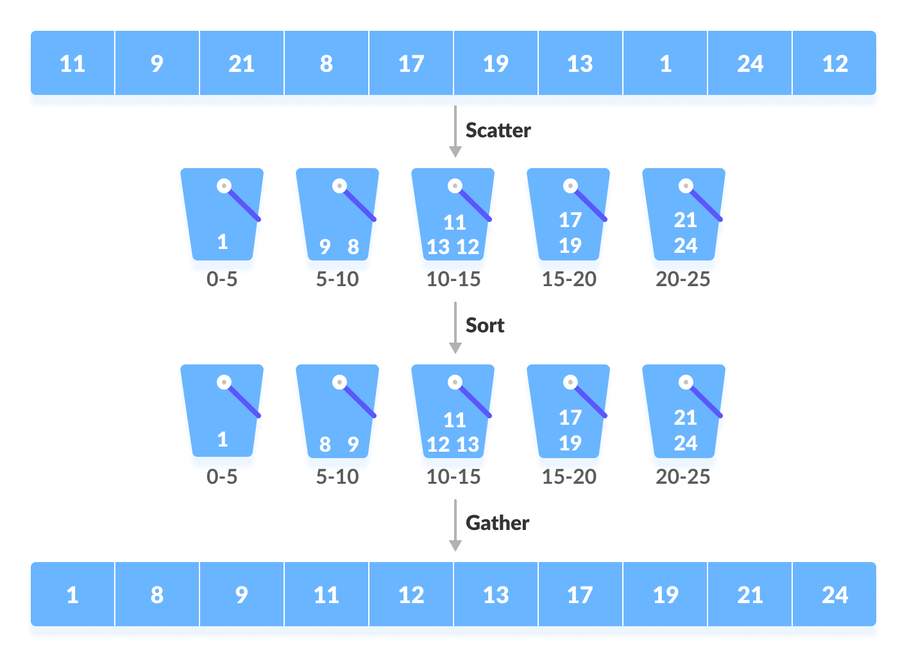

# Bin Sort Algorithm

## Introduction

Bin Sort or Bucket Sort is a sorting technique that sorts the elements by first dividing the elements into several groups called buckets. The elements inside each bucket are sorted using any of the suitable sorting algorithms or recursively calling the same algorithm.

First, several buckets are created. Each bucket is filled with a specific range of elements. The elements inside the bucket are sorted using any other algorithm. Finally, the elements of the bucket are gathered to get the sorted array.

The process of bucket sort can be understood as a scatter-gather approach. The elements are first scattered into buckets then the elements of buckets are sorted. Finally, the elements are gathered in order.

The below image illustrates a simple explanation of how the Bin Sort Algorithm works. To learn more about Bin Sort Algorithm refer to the below-mentioned link.

[Learn more about Bin Sort Algorithm](https://www.programiz.com/dsa/bucket-sort)

## Implementations

Below are some examples of how the Bin Sort Algorithm is implemented using different programming languages.

-   [Go](https://github.com/FOSS-UCSC/FOSSALGO/blob/master/algorithms/ar-binsrt/golang/binsrt.go)
-   [Java](https://github.com/FOSS-UCSC/FOSSALGO/blob/master/algorithms/ar-binsrt/java/BinSort.java)
-   [Python 3](https://github.com/FOSS-UCSC/FOSSALGO/blob/master/algorithms/ar-binsrt/python3/binsrt.py)