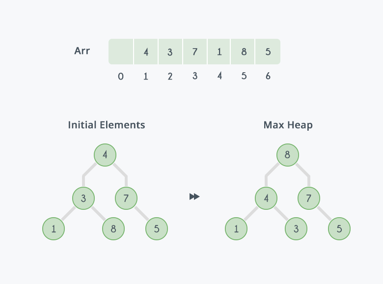
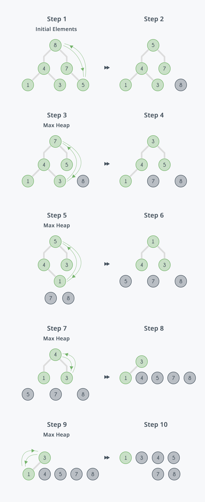

# Heap Sort

## Introduction

Heap sort is a comparison-based sorting technique based on Binary Heap data structure. It is similar to selection sort where we first find the minimum element and place the minimum element at the beginning. We repeat the same process for the remaining elements.

## Algorithm

Heap Sort Algorithm for sorting in increasing order: 
1. Build a max heap from the input data. 
2. At this point, the largest item is stored at the root of the heap. Replace it with the last item of the heap followed by reducing the size of heap by 1. Finally, heapify the root of the tree. 
3. Repeat step 2 while the size of the heap is greater than 1.

[Learn more about Heap Sort Algorithm](https://www.geeksforgeeks.org/heap-sort/)

## Example Illustration

Initially there is an unsorted array *Arr* having 6 elements and then max-heap will be built  

After building max-heap, the elements in the array *Arr* will be  

Steps to perform heap sort  

After all the steps, we will get a sorted array  

## Implementations

Below are some examples of how the Heap Sort Algorithm is implemented using different programming languages.

-   [C](https://github.com/FOSS-UCSC/FOSSALGO/blob/master/algorithms/ar-hsrt/c/heap_sort.c)
-   [CPP](https://github.com/FOSS-UCSC/FOSSALGO/blob/master/algorithms/ar-hsrt/cpp/heap_sort.cpp)
-   [C#](https://github.com/FOSS-UCSC/FOSSALGO/blob/master/algorithms/ar-hsrt/csharp/HeapSort.cs)
-   [Java](https://github.com/FOSS-UCSC/FOSSALGO/blob/master/algorithms/ar-hsrt/java/HeapSort.java)
-   [Python 3](https://github.com/FOSS-UCSC/FOSSALGO/blob/master/algorithms/ar-hsrt/python3/heap_sort.py)
