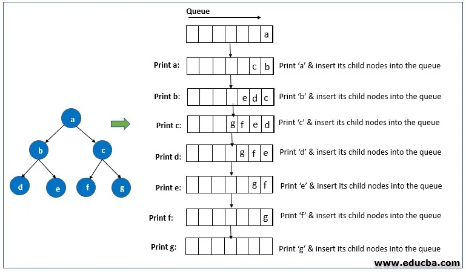

# Breadth first search

## Introduction

Breadth first search is a graph traversal algorithm that starts traversing the graph from root node and explores all the neighbouring nodes. 
Then, it selects the nearest node and explore all the unexplored nodes. 
The algorithm follows the same process for each of the nearest node until it finds the goal.

 [Learn more about Breadth First Search Algorithm](https://www.geeksforgeeks.org/breadth-first-search-or-bfs-for-a-graph/)

 

## Implementations

Below are some examples of how the Breadth First Search Algorithm is implemented using different programming languages.

- [C](https://github.com/FOSS-UCSC/FOSSALGO/blob/master/algorithms/gr-bfsrh/c/bfs.c)
- [C#](https://github.com/FOSS-UCSC/FOSSALGO/blob/master/algorithms/gr-bfsrh/csharp/BreadthFirst.cs)
- [Java](https://github.com/FOSS-UCSC/FOSSALGO/blob/master/algorithms/gr-bfsrh/java/BreadthFirstSearch.java)
- [Python 3](https://github.com/FOSS-UCSC/FOSSALGO/blob/master/algorithms/gr-bfsrh/python3/breadth_first_search.py)
